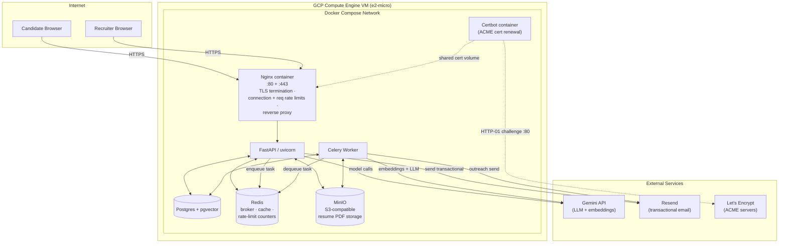

# SmartATS

An AI-powered Applicant Tracking System built with FastAPI, Celery, and Google Gemini.

---

## Architecture



> For full system design, ERD, sequence diagrams covering every major flow (resume upload, semantic search, RAG chat, agent turn, outreach draft + send), deployment topology, security boundaries, and scaling ladder, see [**docs/architecture.md**](docs/architecture.md).

---

## Testing

Two complementary test layers, intentionally separate.

### 1. Unit + route tests — fast, no infra

Pure-function unit tests and FastAPI `TestClient` route checks. Run without Postgres, Redis, MinIO, or a Gemini API key. **135 tests, full suite under 2 seconds.**

```bash
# One-time setup
.venv/bin/pip install -r requirements-dev.txt

# Run the full suite
.venv/bin/python -m pytest

# Single file
.venv/bin/python -m pytest tests/test_outreach.py

# Single test class / function
.venv/bin/python -m pytest tests/test_outreach.py::TestFilterEmailBody
.venv/bin/python -m pytest tests/test_outreach.py::TestFilterEmailBody::test_foreign_url_stripped

# Quiet (summary only)
.venv/bin/python -m pytest -q
```

Coverage map:

| File | Focus | Tests |
|---|---|---|
| [`tests/test_outreach.py`](tests/test_outreach.py) | URL output filter (security), JSON-fence-tolerant parser, prompt construction with `<UNTRUSTED_RESUME>` tag wrapping | 27 |
| [`tests/test_agent.py`](tests/test_agent.py) | `_strip_tool_echoes`, multi-modal `_extract_chunk_text`, tool-palette regression check (13 tools, no `send_email`), guardrail constants | 23 |
| [`tests/test_rerank.py`](tests/test_rerank.py) | `_parse_llm_response` (score clamping + fence handling), Redis cache-key derivation, `RerankResult` invariants | 19 |
| [`tests/test_ai_errors.py`](tests/test_ai_errors.py) | Gemini error classifier (old `google-api-core` + new `google-genai` SDK shapes; daily-quota vs transient) | 11 |
| [`tests/test_models.py`](tests/test_models.py) | Pydantic validation: `JobListing` length/salary, `JobListingUpdate`, `SearchQuery` bounds, `ChatRequest`, `CrossMatchInviteRequest`, `UserCreate` | 25 |
| [`tests/test_security.py`](tests/test_security.py) | Default-`SECRET_KEY` fail-fast, `/upload` 5 MB cap → 413, PDF magic-byte and content-type rejection | 8 |
| [`tests/test_auth_routes.py`](tests/test_auth_routes.py) | Protected routes reject anon callers with 401/403 (every new Phase 6 endpoint included), public pages serve | 22 |

See [`tests/README.md`](tests/README.md) for detailed scope, the `conftest.py` env-var setup that lets `TestClient` run without Redis, and the list of deliberate coverage gaps.

### 2. Smoke tests — full integration, requires running stack

End-to-end tests that hit a real Postgres + pgvector + Redis + Celery + Gemini. Each script provisions its own test fixtures (recruiter, jobs, applications, embeddings) and tears them down on exit. **Each smoke test makes real Gemini API calls** (a handful per run — well within the free tier).

Run from the project root after `docker compose up -d`:

```bash
# Verify Gemini embeddings work (Phase 0)
.venv/bin/python scripts/smoke_test_embeddings.py

# Resume embedding pipeline + Celery task recovery (Phase 1)
.venv/bin/python scripts/smoke_test_phase1.py

# Semantic search (Phase 2 — vector pre-filter only, no rerank)
.venv/bin/python scripts/smoke_test_phase2.py

# Cross-job match end-to-end (Phase 3)
.venv/bin/python scripts/smoke_test_phase3.py

# RAG chat retrieval + grounded answers (Phase 4)
.venv/bin/python scripts/smoke_test_phase4.py

# LLM rerank + Python-vs-Java calibration + degraded fallback (Phase 5/5.2)
.venv/bin/python scripts/smoke_test_phase5.py

# Recruiter assistant agent + cross-match outreach (Phase 6)
.venv/bin/python scripts/smoke_test_phase6.py
```

Or inside the worker container (so you don't need a local venv with full deps):

```bash
docker compose exec worker python scripts/smoke_test_phase6.py
```

### Which layer to use when

| You changed... | Run this first |
|---|---|
| A prompt template or pure function | `pytest tests/` (under 2 s) |
| A SQL query or worker task | The matching `smoke_test_phase*.py` |
| A FastAPI route's auth/validation | `pytest tests/test_auth_routes.py` + `tests/test_security.py` |
| The agent tool palette | `pytest tests/test_agent.py` then `smoke_test_phase6.py` |
| A schema or model | `pytest tests/test_models.py` |
| The outreach send pipeline | `pytest tests/test_outreach.py` then `smoke_test_phase6.py` |
| Anything touching pgvector | The relevant `smoke_test_phase*.py` (vectors aren't unit-testable without real Postgres) |

---

## Documentation

| Topic | Description |
|---|---|
| [**Architecture**](docs/architecture.md) | System design, data model ERD, sequence diagrams for every major flow (resume submit, semantic search, RAG chat, agent turn, outreach), deployment topology, security boundaries, scaling ladder |
| [Security — Threat Model](docs/security.md) | Honest catalogue of attack surface, prompt-injection mitigations (tag-isolation, output filtering, recruiter approval), auth + secret hardening, residual risks, incident-response runbook |
| [Tests — pytest scope + commands](tests/README.md) | Pytest layout, what each test file covers, how `conftest.py` keeps tests hermetic (no Redis / DB needed), when to add a test vs a smoke test |
| [Rate Limiting](docs/rate-limiting.md) | SlowAPI + Redis rate limits on all endpoints, dual user+IP limiting for the AI health probe, race condition safety, fixed window behaviour |
| [DDoS Resistance](docs/ddos-resistance.md) | Nginx connection limits, request rate zones, how Nginx matches zones to URL paths, known gaps |
| [Deployment — GCP](docs/deployment-gcp.md) | Step-by-step GCP Compute Engine free-tier deployment, static IP billing rules, swap space, DB migration, DBeaver firewall |
| [HTTPS / Let's Encrypt](docs/https-ssl.md) | Certbot + Nginx SSL setup, `setup-ssl.sh` usage, certificate auto-renewal, nginx config details |
| [Scaling Workers](docs/scaling-workers.md) | How to scale Celery workers under resume processing load, concurrency tuning, memory limits on e2-micro, when to upgrade the VM |
| [AI Features Roadmap](docs/ai-features/roadmap.md) | Planned RAG / semantic search / agent features, shared pgvector infrastructure, implementation phases, free-tier compatibility |
| [AI Phase 0 — Foundation](docs/ai-features/phase-0-foundation.md) | pgvector setup, embedding tables, ORM choice (SQLModel + drop-down to SQLAlchemy), Gemini embeddings client, smoke test |
| [AI Phase 1 — Embedding Pipeline + Task Recovery](docs/ai-features/phase-1-embedding-pipeline.md) | Resume chunking, embedding Celery task, parallel dispatch, manual retry mechanism for failed tasks (retrofitted to all existing tasks) |
| [AI Phase 2 — Semantic Search](docs/ai-features/phase-2-semantic-search.md) | Semantic search across the recruiter's applicant pool, owner-scoped multi-tenancy, pagination, Redis query embedding cache |
| [AI Phase 3 — Cross-Job Matching](docs/ai-features/phase-3-cross-job-matching.md) | Job description embedding, cross-job match SQL, per-candidate and bulk recheck endpoints, dashboard match badges |
| [AI Phase 4 — RAG-Powered Candidate Q&A](docs/ai-features/phase-4-rag-qa.md) | Chat interface in the analysis modal, streaming responses via SSE, grounded answers with citations, multi-turn conversation memory |
| [AI Phase 5 — LLM Re-ranking](docs/ai-features/phase-5-llm-reranking.md) | Two-stage retrieve-then-rerank enhancement for search and cross-job matching; LLM-based scoring on top of vector pre-filter to fix embedding-similarity inflation (e.g. Python vs Java false matches). Includes 5.1 search-latency follow-up. |
| [Frontend — Multi-Page UI](docs/frontend-multipage.md) | Refactor of the single-page dashboard into separate pages for Jobs overview, per-job applicants, Semantic Search, and Settings; migration plan, decisions, no-framework approach |
| [AI Phase 6 — Recruiter Assistant Agent](docs/ai-features/phase-6-agent.md) | LangGraph chat agent over the Phase 1–5 substrate. Tools for read-only data lookup, job-description authoring, and draft-only candidate outreach (Resend send is recruiter-approved). Cross-match invite one-click shortcut from the candidate modal. Single rolling chat per recruiter. |
