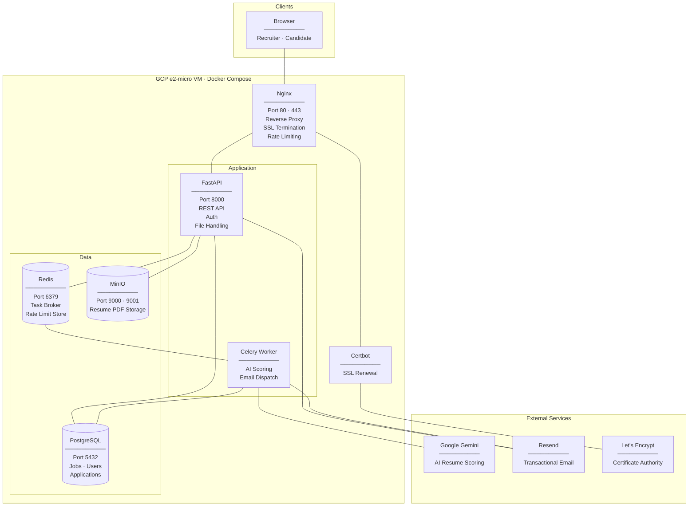

# SmartATS

An AI-powered Applicant Tracking System built with FastAPI, Celery, and Google Gemini.

---

## Architecture

---

## Documentation

| Topic | Description |
|---|---|
| [Rate Limiting](docs/rate-limiting.md) | SlowAPI + Redis rate limits on all endpoints, dual user+IP limiting for the AI health probe, race condition safety, fixed window behaviour |
| [DDoS Resistance](docs/ddos-resistance.md) | Nginx connection limits, request rate zones, how Nginx matches zones to URL paths, known gaps |
| [Deployment — GCP](docs/deployment-gcp.md) | Step-by-step GCP Compute Engine free-tier deployment, static IP billing rules, swap space, DB migration, DBeaver firewall |
| [HTTPS / Let's Encrypt](docs/https-ssl.md) | Certbot + Nginx SSL setup, `setup-ssl.sh` usage, certificate auto-renewal, nginx config details |
| [Scaling Workers](docs/scaling-workers.md) | How to scale Celery workers under resume processing load, concurrency tuning, memory limits on e2-micro, when to upgrade the VM |
