# SmartATS — Architecture

Reference architecture for the SmartATS application. Diagrams are Mermaid (renders natively on GitHub). Each section is self-contained; jump to whichever flow you're debugging.

For per-phase design rationale (the *why* behind each AI feature), see the docs in [`docs/ai-features/`](ai-features/). This file is the *what* and *how* — the structure of the running system.

---

## 1. Elevator pitch

SmartATS is an AI-powered applicant tracking system. Recruiters post jobs; candidates upload resumes; the platform scores fit, lets recruiters semantically search the pool, surfaces cross-job matches, answers natural-language questions about resumes (RAG), and drafts personalised outreach emails through a LangGraph-based agent. Everything runs on a single GCP free-tier VM via Docker Compose; the only paid surface is a Gemini API key (free tier sufficient for small-scale use).

---

## 2. High-level system architecture

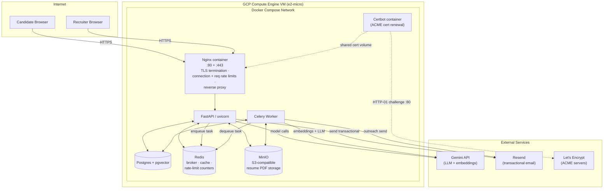

**The single host runs everything**, including TLS termination — Nginx and Certbot are both containers in the `docker-compose.prod.yaml` stack, sharing a Docker volume for the Let's Encrypt certificates. No multi-node orchestration, no managed databases, no Kubernetes. The bottleneck is Gemini's free-tier quota (15 RPM, 1500/day) before it is CPU or RAM. This shape is deliberate: see [`docs/ai-features/roadmap.md`](ai-features/roadmap.md) for the constraint analysis.

---

## 3. Component responsibilities

| Component | Responsibility | Key files |
|---|---|---|
| **Nginx** | TLS termination, connection limits, request rate limits per IP, reverse proxy to FastAPI | [`docs/ddos-resistance.md`](ddos-resistance.md), [`docs/https-ssl.md`](https-ssl.md) |
| **FastAPI / uvicorn** | HTTP request handling, SSE streaming, auth (JWT), application-level rate limits (SlowAPI), tool execution for Phase 6 agent | [`app/main.py`](../app/main.py), [`app/auth.py`](../app/auth.py), [`app/limiter.py`](../app/limiter.py) |
| **Celery Worker** | Long-running tasks: resume parsing + scoring + embedding, job embedding, cross-job matching | [`app/worker.py`](../app/worker.py) |
| **Postgres + pgvector** | Relational data + vector embeddings; vector cosine search via HNSW indexes | [`app/database.py`](../app/database.py), [`app/models.py`](../app/models.py) |
| **Redis** | Celery broker + result backend, query/rerank caches, rate-limit counters, chat history (Phase 4 + Phase 6), short-lived session state | [`app/embeddings.py`](../app/embeddings.py), [`app/rerank.py`](../app/rerank.py), [`app/agent.py`](../app/agent.py) |
| **MinIO** | S3-compatible object storage for resume PDFs (internal-only, accessed via `/download/{key}` proxy) | [`app/utils.py`](../app/utils.py) |
| **Gemini** | `gemini-2.5-flash` for scoring / rerank / RAG / agent / outreach; `gemini-embedding-001` for vectors. Model name overridable via `LLM_MODEL_NAME` env var. | [`app/ai.py`](../app/ai.py), [`app/embeddings.py`](../app/embeddings.py), [`app/rerank.py`](../app/rerank.py), [`app/rag.py`](../app/rag.py), [`app/outreach.py`](../app/outreach.py), [`app/agent.py`](../app/agent.py) |
| **Resend** | Transactional email (verification, password reset, outreach to candidates). Recruiter-approved sends only. | [`app/email.py`](../app/email.py) |

---

## 4. Data model

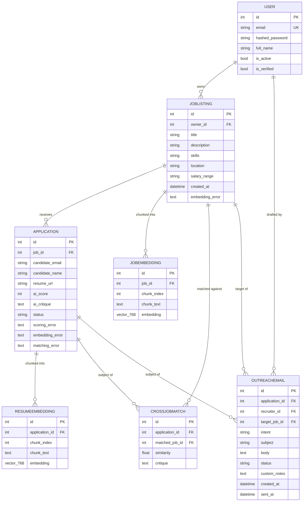

**Cascade behaviour**: deleting a `JobListing` cascades to its `Application` rows and their `ResumeEmbedding`s + `CrossJobMatch`es + `OutreachEmail`s. Deleting a `User` cascades through their jobs. `OutreachEmail.target_job_id` is `ON DELETE SET NULL` so audit rows survive job deletions.

**Vector storage**: `vector_768` is `pgvector`'s 768-dimensional float array, matching the dimension we request from `gemini-embedding-001`. HNSW indexes on the `embedding` columns are created in `app/database.py` at startup (SQLModel can't express HNSW declaratively).

---

## 5. Request flows — sequence diagrams

### 5.1 Candidate applies (resume upload + scoring + matching)

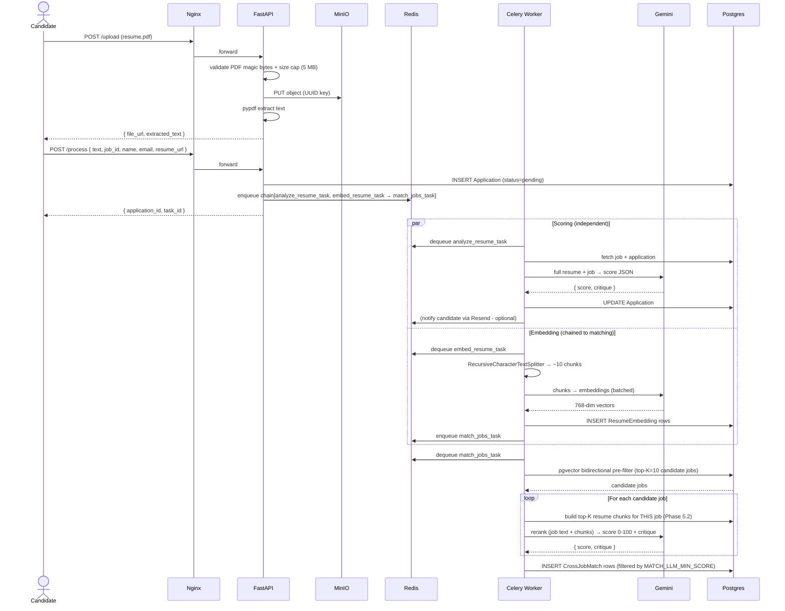

See [`docs/ai-features/phase-1-embedding-pipeline.md`](ai-features/phase-1-embedding-pipeline.md), [`phase-3-cross-job-matching.md`](ai-features/phase-3-cross-job-matching.md), [`phase-5-llm-reranking.md`](ai-features/phase-5-llm-reranking.md).

---

### 5.2 Recruiter login + dashboard load

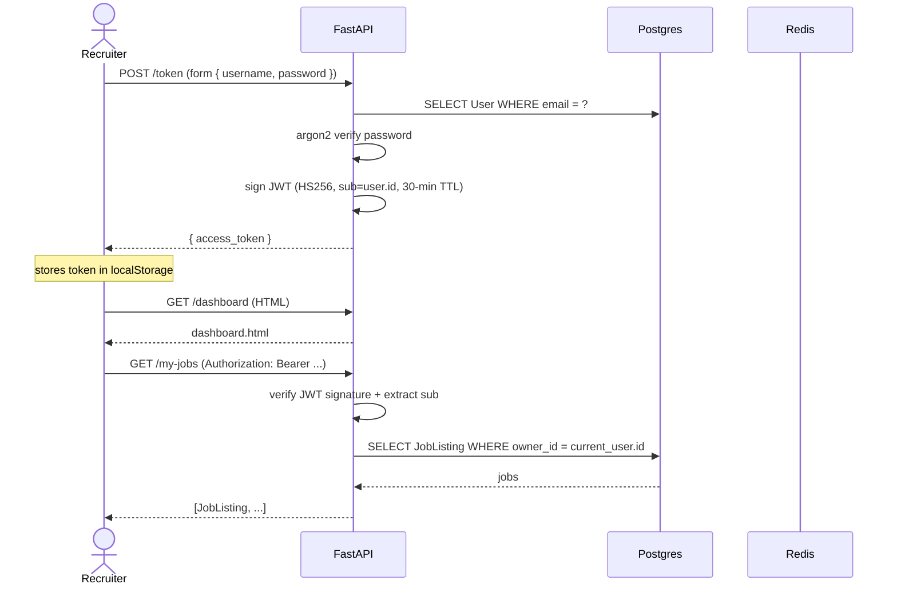

JWT validation happens via the `get_current_user` dependency on every protected endpoint. See [`app/auth.py`](../app/auth.py).

---

### 5.3 Semantic search (Phase 2 + Phase 5 rerank)

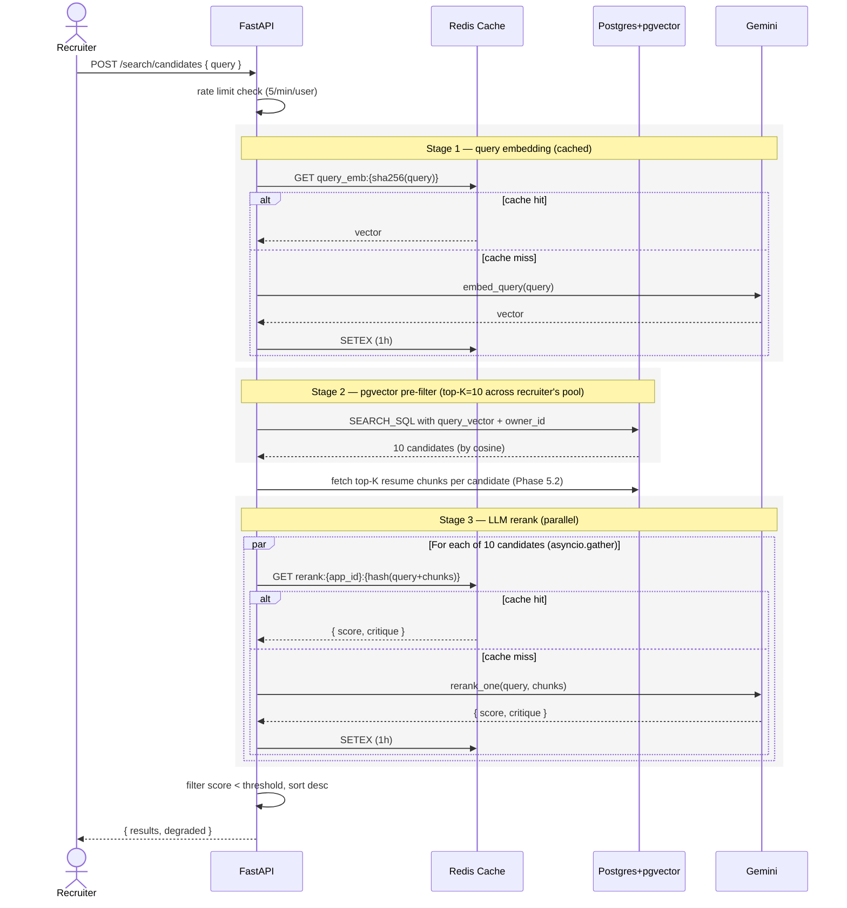

See [`docs/ai-features/phase-2-semantic-search.md`](ai-features/phase-2-semantic-search.md) + [`phase-5-llm-reranking.md`](ai-features/phase-5-llm-reranking.md).

---

### 5.4 RAG chat (Phase 4)

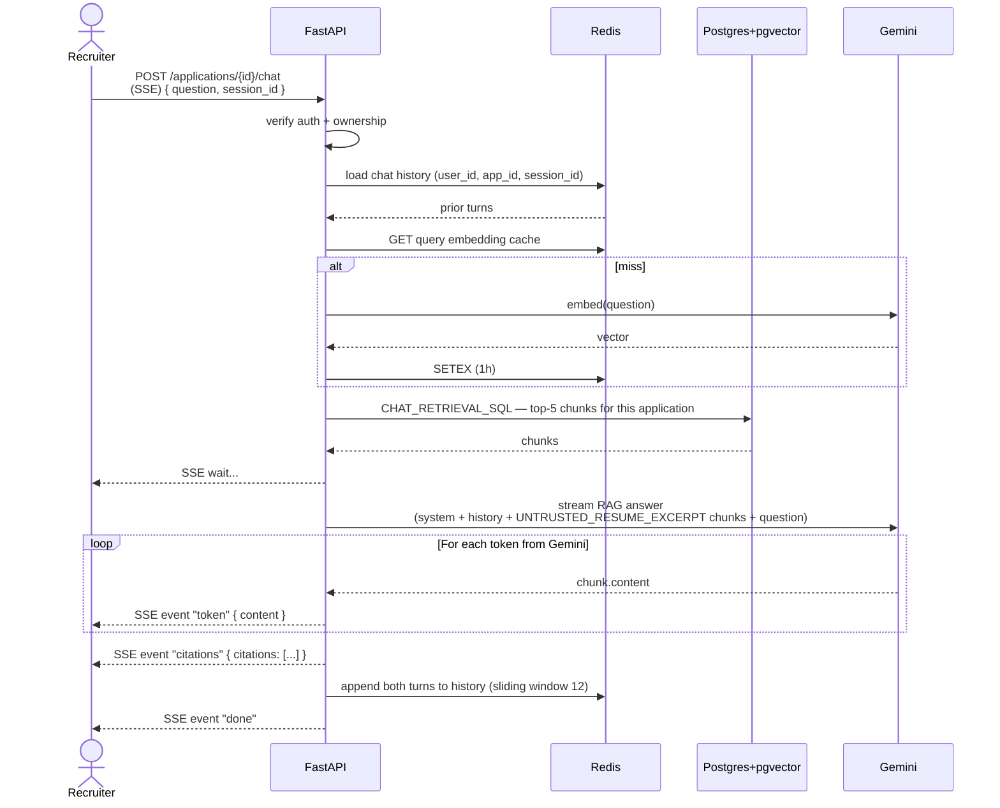

See [`docs/ai-features/phase-4-rag-qa.md`](ai-features/phase-4-rag-qa.md).

---

### 5.5 Phase 6 agent turn (LangGraph ReAct loop)

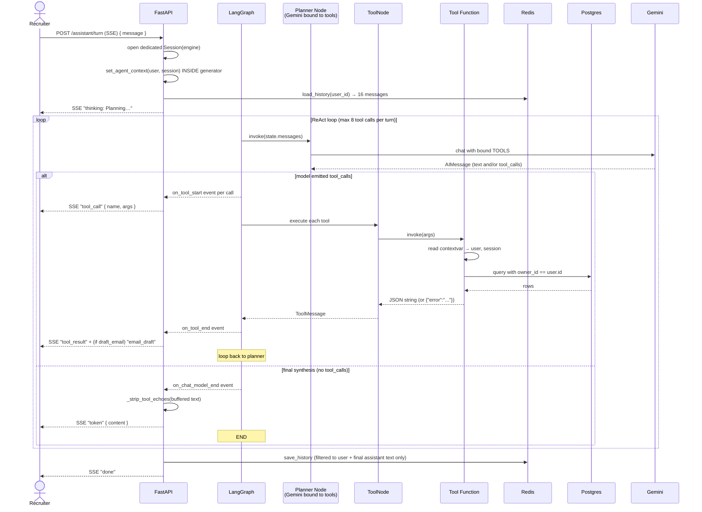

The contextvar setup happens **inside** the generator (not in the endpoint body) because Starlette runs the generator in its own asyncio context — see [`docs/ai-features/phase-6-agent.md`](ai-features/phase-6-agent.md) failure modes table.

See also [`notes/agent-walkthrough.md`](../notes/agent-walkthrough.md) for line-by-line agent.py explanation (gitignored personal notes).

---

### 5.6 Outreach draft + send (Phase 6)

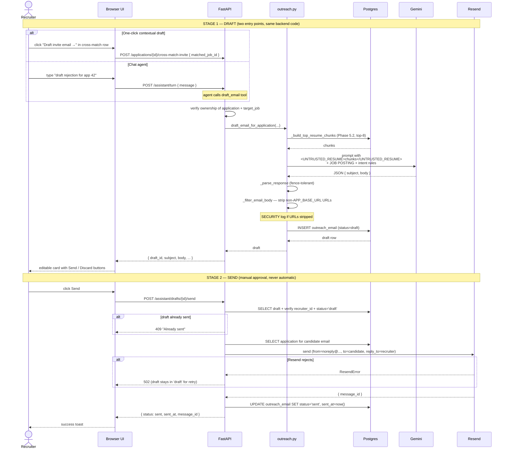

See [`docs/ai-features/phase-6-agent.md`](ai-features/phase-6-agent.md), [`notes/outreach-walkthrough.md`](../notes/outreach-walkthrough.md).

---

## 6. Data flow — at a glance

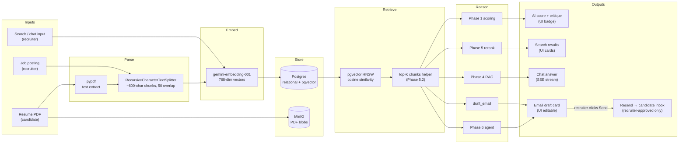

---

## 7. Async task pipeline

When a candidate submits an application, three tasks run in this dependency order:

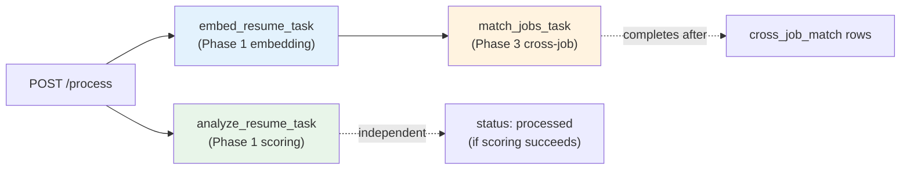

`analyze_resume_task` and `embed_resume_task` are dispatched **in parallel** at submission. `match_jobs_task` is **chained** after `embed_resume_task` because it depends on `resume_embedding` rows existing.

Each task uses Celery's `autoretry_for=(GeminiUnavailableError,)` with exponential backoff. Permanent failures land in the application's `scoring_error` / `embedding_error` / `matching_error` columns, and the dashboard shows a Retry button.

See [`docs/ai-features/phase-1-embedding-pipeline.md`](ai-features/phase-1-embedding-pipeline.md).

---

## 8. AI inference pipeline — per-phase LLM map

| Phase | Trigger | LLM call(s) | Cached? |
|---|---|---|---|
| 1 — Initial scoring | candidate applies | 1× gemini-2.5-flash on full resume + job | No |
| 1 — Resume embedding | candidate applies | N × gemini-embedding-001 (chunked) | No (persisted to pgvector) |
| 1 — Job embedding | recruiter creates job | N × gemini-embedding-001 (chunked) | No (persisted to pgvector) |
| 2 — Search rerank | recruiter searches | 1× embed query + up to 10× rerank | Both cached in Redis (1 h TTL) |
| 3 — Cross-job match | application embeds finished | Up to 10× rerank per task | Rerank cached in Redis (1 h TTL) |
| 4 — RAG chat | recruiter asks | 1× embed question + 1× streaming RAG | Question embed cached |
| 5 — Rerank | called by Phases 2 + 3 | (see above) | Per (app_id, query, chunks) hash |
| 6 — Agent turn | recruiter sends message | 1× per planner step + 1× per tool that calls LLM | History in Redis 7-day TTL |
| 6 — Outreach draft | agent or one-click | 1× gemini-2.5-flash with strict JSON output | No |

**Model is configured via `LLM_MODEL_NAME` env var** (default `gemini-2.5-flash`). Operators can switch model versions without code changes.

---

## 9. Security boundaries

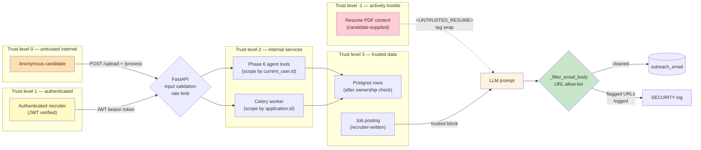

**Three lines of defence against prompt injection in candidate resumes:**

1. **Tag-isolation in the prompt** — candidate content wrapped in `<UNTRUSTED_RESUME>` tags; system prompts have explicit rules to treat tag contents as data only.
2. **Output filtering** — `_filter_email_body()` strips any URL not on `APP_BASE_URL`'s host before persisting drafts.
3. **Recruiter approval** — the LLM never sends. Every outreach email requires an explicit human click.

See [`docs/security.md`](security.md) for the full threat model, mitigation matrix, and changelog.

---

## 10. Deployment topology — GCP free-tier

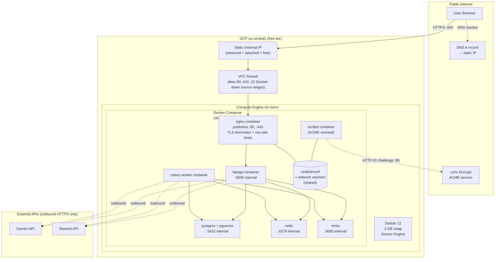

**Why this shape**:

- Single-host because the bottleneck is Gemini's RPM quota, not compute.
- e2-micro is free indefinitely (US regions only — see [`docs/deployment-gcp.md`](deployment-gcp.md)).
- 2 GB swap because 1 GB RAM is tight with all containers running.
- **Nginx and Certbot both live inside `docker-compose.prod.yaml`** and share a Docker volume for the Let's Encrypt cert + webroot directory. Certbot writes the challenge file into the webroot volume; Nginx serves it on `:80` at the `/.well-known/acme-challenge/` path, so the HTTP-01 challenge resolves without bouncing outside the Compose network. See [`docs/https-ssl.md`](https-ssl.md).
- All non-Nginx containers listen on internal Compose-network addresses only; only the `nginx` container publishes `:80` and `:443` to the host.
- VPC firewall locks SSH (port 22) to the operator's IP range; only 80 / 443 open to the world.

---

## 11. Scaling considerations

Realistic next-step ladder when the free tier saturates:

| Symptom | Next step | Effort |
|---|---|---|
| Gemini quota exhausted daily | Upgrade Gemini to paid tier | Env var change |
| FastAPI CPU bound | `uvicorn --workers N` (single VM still) | docker-compose tweak |
| Celery worker queue depth growing | `celery --autoscale=6,2` (within container) | docker-compose tweak |
| Postgres connection pool exhausted | Add PgBouncer in front | New container in compose |
| Single VM CPU saturated | Bump e2-micro → e2-small / e2-medium | Resize, reboot |
| Need geographic redundancy | GCP Managed Instance Group + Load Balancer | Real infra work |
| Multiple worker hosts needed | Scale workers in MIG + Redis-backed shared broker | Real infra work |
| Genuine "platform" with multiple teams | Then and only then consider GKE / K8s | Weeks of work |

**Don't reach for Kubernetes until you're past at least three of these steps.** The autoscaling story is "Celery `--autoscale` for worker concurrency, MIG with custom metrics for HTTP, paid Gemini for LLM throughput." See [`docs/scaling-workers.md`](scaling-workers.md).

---

## 12. Glossary of phases

| Phase | What | Doc |
|---|---|---|
| 0 | Foundation: pgvector, embedding tables, Gemini client | [`phase-0-foundation.md`](ai-features/phase-0-foundation.md) |
| 1 | Resume + job chunking and embedding pipeline | [`phase-1-embedding-pipeline.md`](ai-features/phase-1-embedding-pipeline.md) |
| 2 | Semantic search across recruiter's pool | [`phase-2-semantic-search.md`](ai-features/phase-2-semantic-search.md) |
| 3 | Cross-job matching with bidirectional cosine | [`phase-3-cross-job-matching.md`](ai-features/phase-3-cross-job-matching.md) |
| 3.1 | Inverse cross-job view on per-job page | same doc, Update 3.1 |
| 4 | RAG-powered Q&A chat over a resume | [`phase-4-rag-qa.md`](ai-features/phase-4-rag-qa.md) |
| 5 | LLM rerank on top of pgvector (Phases 2 + 3) | [`phase-5-llm-reranking.md`](ai-features/phase-5-llm-reranking.md) |
| 5.1 | Search latency follow-up | same doc, Follow-up 5.1 |
| 5.2 | Top-K resume chunks to rerank | same doc, Follow-up 5.2 |
| 6 | Recruiter assistant agent + outreach | [`phase-6-agent.md`](ai-features/phase-6-agent.md) |

---

## 13. Where to read next

- **Designing a new AI feature**: start with [`phase-5-llm-reranking.md`](ai-features/phase-5-llm-reranking.md) — its decision-table format is the convention.
- **Operating this in production**: [`docs/deployment-gcp.md`](deployment-gcp.md), [`docs/https-ssl.md`](https-ssl.md), [`docs/scaling-workers.md`](scaling-workers.md), [`docs/security.md`](security.md).
- **Understanding the agent**: [`notes/agent-walkthrough.md`](../notes/agent-walkthrough.md) (gitignored personal notes — read after the Phase 6 doc).
- **Debugging an SSE issue**: section 5.5 (agent) or 5.4 (RAG) sequence diagrams above, then the relevant phase doc's failure-modes table.
